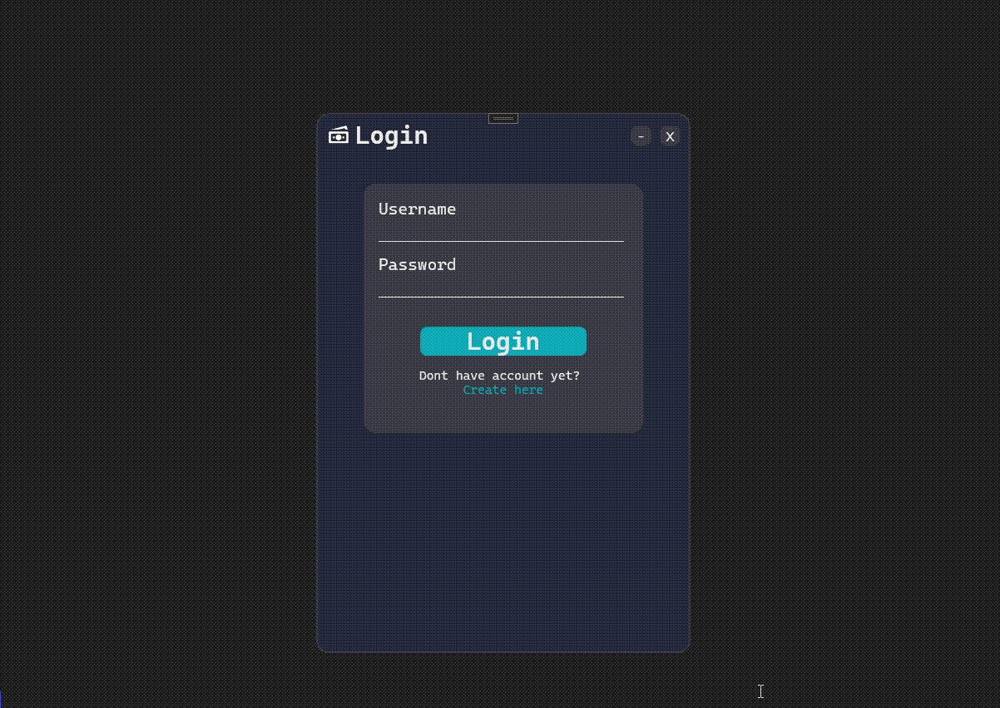

# WPF-Bank-Accounts

Tento projekt byl mým prvním pokusem o využití animací ve WPF a propojení s databází SQLite. 

## Klíčové vlastnosti
- Simulace bankovního systému
- Vykreslování výdajů a jejich ukládání do databáze
- Práce s WPF a SQLite

## Ukázka

Projekt sloužil jako experiment s vizuálními prvky a databázovým propojením. Nebyly zde použity žádné design patterny, protože jsem je v té době ještě neznal. 😄 Kód obsahuje mnoho nedostatků, ale hlavním cílem bylo pochopit základní principy práce s WPF a databázemi.
